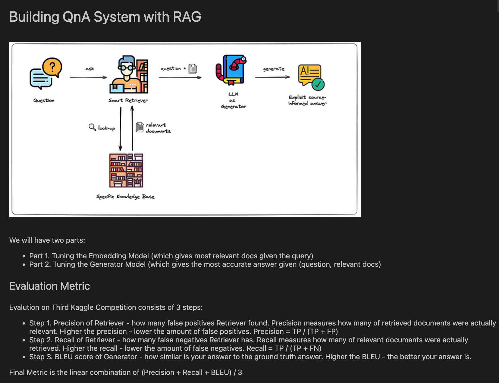
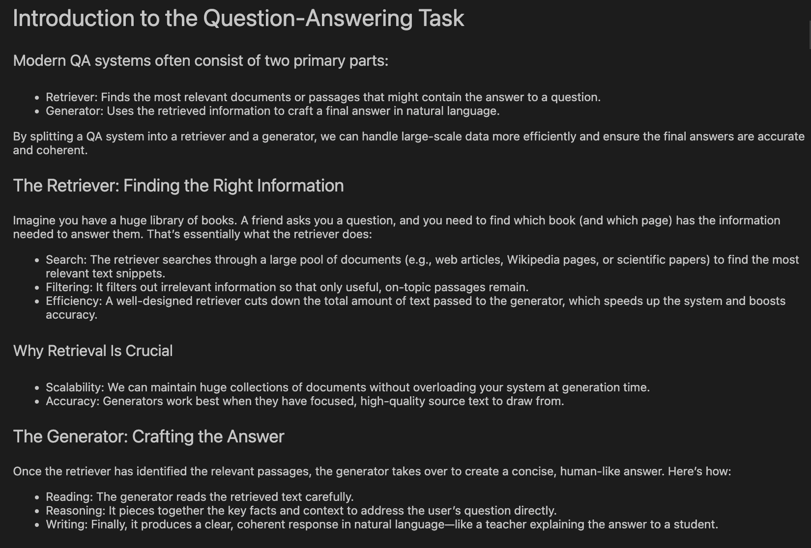
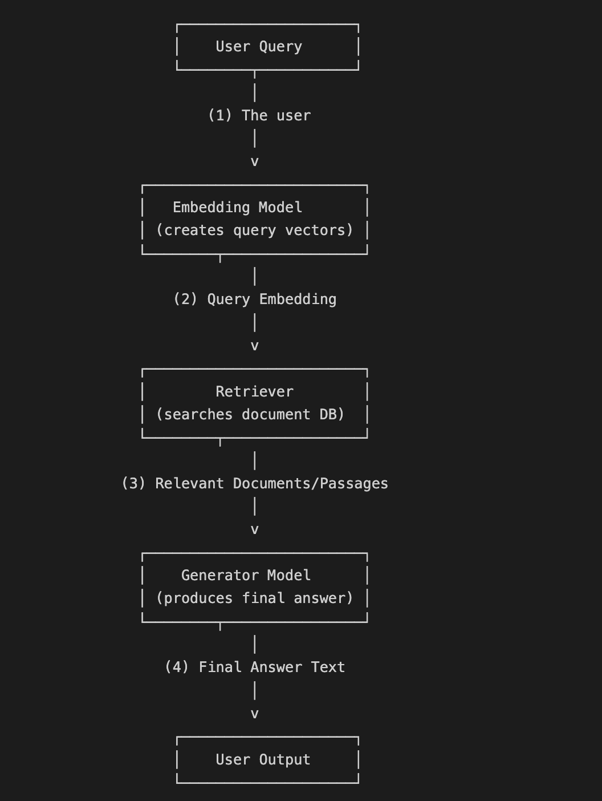
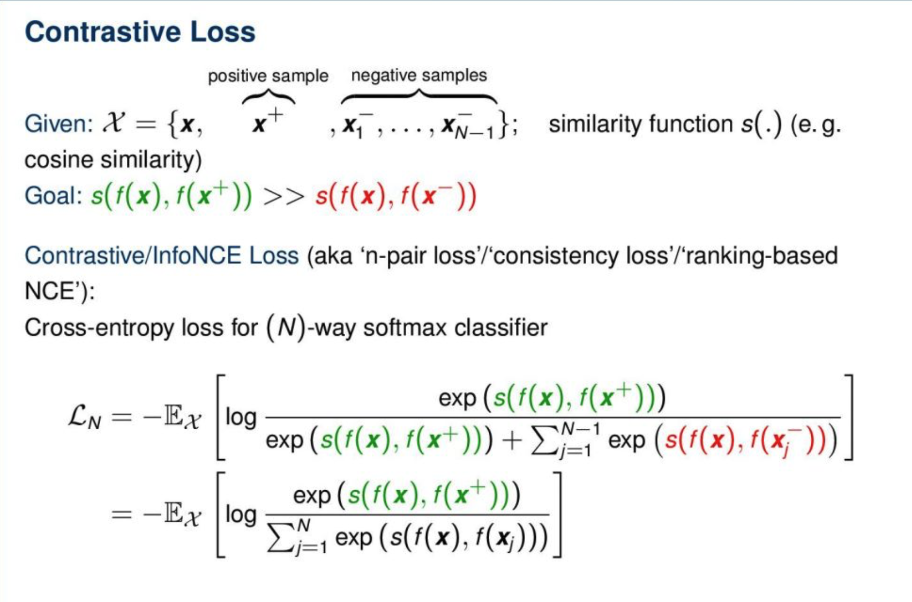

# Transformer-based Retrieval and Generation for QA

This project implements a **Transformer-based Question Answering (QA) system**,  
using **DistilBERT** as the retriever and **Mistral-7B** as the generator.

